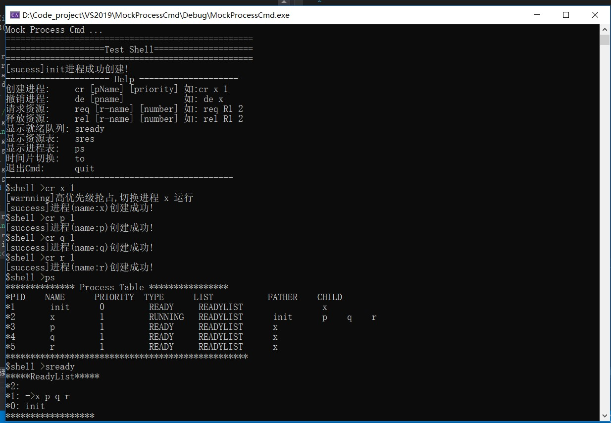

# MockProcessCmd
[Experiment]设计和实现基于时间片与高优先级抢占调度算法的进程与资源管理功能模拟OS

>Computer operating system experiment.

### 开发环境
- IDE：Visual Studio 2019
- Language：C++ STL

### 功能需求
设计和实现进程与资源管理，并完成Test shell的编写，以建立系统的进程管理、调度、资源管理和分配的知识体系。该管理器能够完成进程的控制，如进程创建与撤销、进程的状态转换；能够基于优先级调度算法完成进程的调度，模拟时钟中断，在同优先级进程中采用时间片轮转调度算法进行调度；能够完成资源的分配与释放，并完成进程之间的同步。该管理器同时也能完成从用户终端或者指定文件读取用户命令，通过 Test shell 模块完成对用户命令的解释，将用户命令转化为对进程与资源控制的具体操作，并将执行结果输出到终端或指定文件中。同时要求设计与实现驱动程序（test shell）：驱动该管理器工作，即将命令语言（即用户要求）转换成对与内核函数（如create, request等）的调用。 

>细节设计：

>创建新进程时，新进程的父进程为运行态进程，新进程作为运行态的子进程;

>有高优先级进程就绪态后马上抢占;

>撤销父进程时，需要循环kill光所有子进程;

>释放资源后如有进程可得到资源马上转入就绪态;

### 系统功能总体设计

共设计4个大模块：

- PCB进程控制块

	该模块包含进程PCB的数据结构以及操作PCB内部数据变化的接口；

- RCB资源控制块

	该模块包含进程PCB的数据结构以及操作PCB内部数据变化的接口；

- 进程管理模块

	该模块负责管理整个程序的进程池和资源池，对进程进行创建、撤销以及调度等管理任务，对资源进行分配和释放，维护着程序的就绪等待队列、阻塞等待队列，提供了对程序操作的命令接口，基于时间片与高优先抢占调度算法；
>三个优先级就绪队列
>System-2  User-1  Init-0

- Cmd命令行模块

	该模块负责从用户终端Cmd中读取用户命令，完成对用户命令的解释，将用户命令转化为对进程与资源控制的具体操作，调用操作接口API并将执行结果输出到终端中。

~~~
void inputCmd(vector<string>& argvs);                    // 命令输入模块
void initCmd();                                          // Cmd初始化模块
void createProcessCmd(const vector<string>& argvs);      // 进程创建模块
void destroyProcessCmd(const vector<string>& argvs);     // 进程释放模块
void requestResourcesCmd(const vector<string>& argvs);   // 资源申请模块 
void releaseResoursesCmd(const vector<string>& argvs);   // 资源释放模块 
void showReadyListCmd(const vector<string>& argvs);      // 显示就绪队列 
void showResourcesListCmd(const vector<string>& argvs);  // 显示资源情况 
void timeOutCmd(const vector<string>& argvs);            // 时间片切换(调度) 
void quitCmd(const vector<string>& argvs);               // 退出Cmd
void showHelpCmd(const vector<string>& argvs);           // 显示帮助信息(自启) 
void showProcessTable(const vector<string>& argvs);      // 显示进程表 
void showOneProcess(const vector<string>& argvs);        // 显示某个进程情况 
~~~

### 类设计图

### 小模块

- Cmd命令处理模块
- init进程自启动模块
- 创建新进程模块
- 释放进程模块
- 请求资源模块
- 释放资源模块
- 调度程序模块
- 测试验证输入模块
- 界面优化与测试

### 待处理注释key:
- todo
- del
- test

### 后期改进：

- 把容器换成链式指针数据结构
- 把多级队列封装成类，可快速拓展
- 根据进程的Type进行优先级墙长调度，去除臃肿的升降级代码
- 优化STL容器的使用
- 增加PPID 父进程ID

### 已知BUG日志：

- 释放资源高优先级抢占升级
- 撤销进程循环free resources逻辑
- init进程释放资源是出现BUG

### 版本
- 可演示界面一般存在明显BUG version=1

### 效果截图

